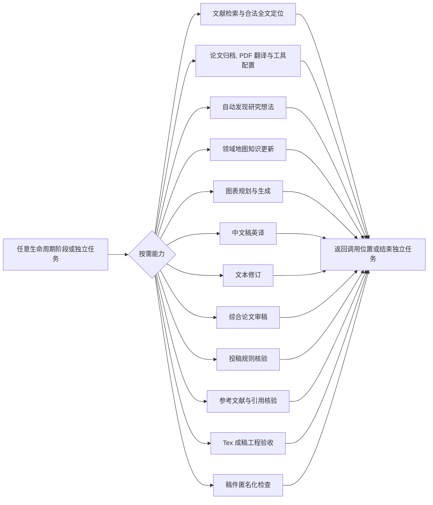

# 学术研究生命周期与能力路由

本文回答五个问题:

1. 用户当前要完成什么？
2. 这项工作会改变任务主线, 还是一次按需能力调用？
3. 当前生命周期阶段和状态是什么？
4. 可以推荐转移到哪里, 或调用哪些能力？
5. 需要什么输入, 产物和用户确认？

全局边界见 `AGENTS.md`, 共同执行协议见 `指导/使用说明.md`, 具体做法见本文列出的专项指导

## 1. 两类工作

### 1.1 生命周期阶段

生命周期阶段表示任务主线发生了可交接的变化, 并拥有阶段状态

| 编号 | 阶段 | 主线变化 |
|---|---|---|
| L1 | 学习规划与阅读方案 | 从领域输入形成目标, 范围和阅读方案 |
| L2 | 领域知识地图 | 形成可持续更新的领域结构和知识索引 |
| R1 | Idea 审查与立项 | 从原始想法形成审查结论, 并决定是否建立研究项目 |
| R2 | Story 与核心主张 | 形成确认的论文叙事和可证伪 Claim |
| R3 | 实验证明设计 | 定义经验研究怎样支持, 削弱或推翻 Claim |
| R4 | 实验实施计划 | 把证明设计映射到真实实验仓库和可执行计划 |
| R5 | 实验执行与记录 | 产生真实代码运行, 失败和原始结果记录 |
| R6 | 结果判断与论文口径 | 判断证据强度并确定论文允许采用的表述 |
| R7 | 论文写作 | 以任意章节顺序持续形成, 修订和核对稿件 |
| R8 | 投稿准备 | 汇总终稿检查, 清除硬性阻断项并记录投稿决定 |

阶段编号只表示推荐主线, 不是门禁, 用户可以直接进入任意技术上可执行的阶段, 也可以明确跳过任意阶段

### 1.2 按需能力

按需能力类似函数: 由阶段或用户直接调用, 完成后返回调用位置, 不改变生命周期阶段
能力可以重复调用, 也可以作为不创建完整生命周期的一次性任务执行

能力产物不能把未执行阶段标为完成, 例如, 独立完成综合审稿不会自动完成论文写作
生成图表不会自动证明实验 Claim

## 2. 状态模型

### 2.1 阶段状态

| 状态 | 判定 |
|---|---|
| **未开始** | 尚未进入该阶段, 也没有用户明确跳过,  |
| **执行中** | 范围已确认, 正在形成阶段产物, 完成条件尚未满足,  |
| **等待确认** | 产物或候选决定已经形成, 但关键用户决定尚未回写,  |
| **已完成** | 有效产物和必要确认均已具备, 可作为后续可靠输入,  |
| **已跳过** | 用户明确决定跳过, 原因和对后续证据边界的影响已经回写,  |
| **阻塞** | 已要求执行, 但权限, 资源, 输入冲突或其他客观条件使目标无法可靠完成,  |

“文件存在”不等于“已完成”, 只有标题, 占位符, 无依据草稿或未记录必要确认的文件不是有效产物

跳过也不等于完成, 用户要求跳过时, Agent 先说明影响, 把决定, 原因和证据限制写入目标阶段或当前交接文档, 然后继续用户指定的目标, 只有目标行为本身技术上无法完成时才标记阻塞, 不能用推荐前序阶段强迫用户绕回

### 2.2 任务整体结果

| 结果 | 判定 |
|---|---|
| **活跃** | 仍有用户认可的目标正在执行, 等待确认或可继续推进,  |
| **完成** | 用户目标已经达成, 当前没有必须继续的生命周期工作,  |
| **终止** | 用户明确停止任务, 或 Idea 被否决后用户决定不再继续,  |

终止不是阻塞, 任务结果同样从真实文档和用户决定推导, 不新增状态文件

### 2.3 当前工作判断顺序

1. 确定用户目标是生命周期推进, 返工, 跳过, 还是独立能力调用
2. 定位已有领域目录, 论文目录或研究项目目录, 或按第 3 节处理新目标
3. 先列出对应目录内容并通读控制文档, 正文, 译文, 稿件, 机器缓存和大体量结果仅在
   当前目标需要语义判断时按最小范围读取
4. 检查有效产物, 用户确认, 跳过记录, 冲突和能力调用的返回位置
5. 先处理与当前目标直接冲突的未决确认, 用户明确改换目标时记录影响后重新路由
6. 新证据推翻旧判断时, 定位受影响的最早阶段, 但是否返工仍由用户决定
7. 推导任务整体结果, 当前阶段和阶段状态, 独立能力不伪造阶段状态
8. 读取通用协议和对应专项指导后执行

当前阶段是“用户当前主线所在的位置”, 不是编号最大的文件, 当前能力是“此刻被调用的专项操作”, 调用完成后返回主线或结束一次性任务

## 3. 工作对象初始化

`workspace/` 顶层保持扁平, 其直接子目录是 `workspace/<中文领域名>/` 或
`workspace/<中文研究项目名>/`, 不创建 `学习/`, `研究/` 等固定类型中间层, 也不创建 `任务状态.md`

### 3.1 新学习任务

先确认中文领域名, 领域范围, 学习目标和首次产物, 用户确认首次落盘后创建
`workspace/<中文领域名>/`, 只创建 L1 当前需要的文档

### 3.2 孤立论文的归档与处理

用户提供论文文件, 但没有指定已有领域目录时:

1. 先检查 `workspace/` 下现有领域目录和论文档案
2. 优先根据标题, 元数据, 摘要和已有领域地图提出一个或多个可能的领域归属, 仅在这些
   信息不足以分类时读取最小必要正文, 不得为了路径判断阅读全文
3. 询问用户应加入哪个已有领域, 或确认创建哪个新的中文领域目录
4. 与用户确认论文中文短标题, 最终目录和外部正文传输
5. 按 `workspace/<中文领域名>/<论文中文短标题>/` 归档和处理, 不增加
   `论文资料/` 中间层

领域归属是知识组织决定, 不由 Agent 从标题或摘要静默推断, 若同一论文服务多个领域,
选择一个主档案位置, 其他领域通过地图, 列表或文档链接引用, 不复制多套档案

“归档”至少包括保留原始文件, 记录来源与版本, 计算文件哈希, 记录归档日期, 并建立可追溯的 `论文信息.md` 和 `论文处理记录.md`, PDF 翻译, 阅读笔记和评议都继续写入同一个论文目录

### 3.3 新研究 Idea

R1 的初步审查先在对话中完成, 不因收到一个原始 Idea 就创建永久研究目录, 只有本质假设, 撞车和硬度审查通过, 并且用户确认立项后, 才创建中文研究项目目录和 R1 正式产物, Idea 被否决且用户停止时, 任务结果是终止, 不是阻塞

若用户指定了已有目录, 则在该目录中审查和回写, 不重复初始化

### 3.4 自动发现的候选

`自动发现研究想法候选.md` 保存在当前领域或发现工作目录中, 用户选中候选后进入 R1
预审, R1 通过并确认立项前, 不创建独立研究目录

### 3.5 独立能力任务

审稿, 翻译, 文本修订, 引用核验, Tex 验收, 匿名检查等能力可以独立运行, 没有明确输出位置时, 先确认输入, 归属和首次落盘位置, 不得为套用生命周期而补建无关阶段文件, 纯文本临时处理可以使用用户指定位置, 涉及论文归档时必须遵守第 3.2 节

### 3.6 组合目标

用户把多个动作作为一个目标提出时, 例如“归档并翻译”, 默认把它们视为一个整体:

- 路径, 必要环境, 权限和外部传输确认全部满足后再首次落盘
- 任一必要动作无法完成时, 整体目标标为阻塞
- 可以继续执行只读检查和故障诊断, 但不默认留下被描述为已完成的部分产物
- 只有用户明确同意拆分为“先完成可执行部分, 之后继续其余部分”时, 才分段落盘,
  并清楚记录尚未完成的动作

### 3.7 独立实验仓库

- `labs/` 是被根研究仓库忽略的本地容器, 每个直接子目录可以是独立 Git 仓库
- 用户负责创建 `labs/` 并手动准备目标仓库, Agent 不执行 clone, git init 或命名
- R4 或 R5 需要实验仓库而仓库不存在时, 阶段为阻塞, 并说明所需上游和目标位置
- 仓库存在时, 先读取其 `AGENTS.md` 和工程规范, 再按独立工作区规则操作
- 代码, 配置, 日志, 原始结果和工程产物留在独立仓库, 内部布局由该仓库决定
- 中文研究项目目录保存研究级计划, 实验记录, 失败记录和结果分析, 并引用仓库路径,
  commit, 命令, 配置和实际产物位置

## 4. 意图路由

| 用户意图 | 默认路由 | 先确认或检查 |
|---|---|---|
| 学习一个领域或生成阅读方案 | L1 | 范围, 基础, 目标, 时间和篇数 |
| 建立领域整体认知 | L2 | 已知材料, 知识问题和地图范围 |
| 审查原始 Idea | R1 | 原始 Idea, 背景和立项标准 |
| 构造 Story 或 Claim | R2 | R1 结论或用户允许跳过 R1 的决定 |
| 设计, 计划, 执行或分析实验 | R3-R6 中对应阶段 | Claim, 资源, 仓库和已有记录 |
| 写论文 | R7 | 可用 Story, Claim, 证据及已跳过阶段的影响 |
| 准备投稿 | R8 | 稳定稿件, venue, track, 时间和提交材料 |
| 归档孤立论文 | 论文处理能力 | 用户确认的领域归属, 论文目录名, 版本和首次落盘 |
| 获取或处理论文材料 | 对应文献或论文处理能力 | 目标论文, 领域路径, 合法来源, 处理范围和传输许可 |
| 自动发现 Idea | 自动发现研究想法能力 | 领域, 资源条件和研究偏好 |
| 绘图, 翻译, 修订或审稿 | 对应能力 | 明确输入, 目标, 保护项和输出位置 |
| 核验投稿规则 | 投稿规则核验能力 | venue, 年份, track 和核验模式 |
| 核验引用, 验收 Tex 或匿名检查 | 对应终稿能力 | 当前稿件, 项目工具链和输出位置 |

## 5. 推荐生命周期

箭头只表示常见路线, 用户可以从 R1 开始而不经过学习阶段, 可以从 R2 直接进入 R7,
也可以结束于任何阶段, 直接跳转时, 未执行阶段保持未开始或按用户明确决定记为已跳过
不得自动记为已完成

R3-R6 面向计算机科学经验研究, 非实验论文或用户明确要求时可以跳过, 但 R7 不得把缺失实验写成已支持的 Claim

## 6. 能力调用与返回

能力可以在同一阶段反复调用, 综合审稿后可以调用绘图或修订, 再次审稿, 投稿规则核验通常在 R7 前期和 R8 终稿各执行一次, 并持续更新同一份 `投稿规范检查.md`

## 7. 生命周期阶段契约

### L1 学习规划与阅读方案

- **主指导**: `指导/学习/领域学习论文列表生成.md`
- **辅助指导**: `指导/学习/候选文献检索.md`
- **输入**: 领域, 已有基础, 目标, 时间和篇数限制
- **产物**: `学习目标.md`, `论文列表候选.md`, 确认后的 `最终论文列表.md`
- **确认点**: 学习重心, 候选方案和最终列表
- **完成条件**: 列表信息可核验, 角色明确, 用户选择已经回写
- **推荐转移**: L2, 或在学习目标达成后直接完成任务

### L2 领域知识地图

- **主指导**: `指导/学习/领域全景地图.md`
- **输入**: 学习目标, 阅读方案, 已核验来源和当前知识问题
- **产物**: 持续更新的 `领域全景地图.md`
- **确认点**: 初始地图结构, 关键分歧和下一步知识缺口
- **完成条件**: 初始领域结构和首批 K 条目可追溯, 用户确认地图可作为后续索引
- **持续更新**: 初始阶段完成后, 后续证据通过“领域地图知识更新”能力写入, 不要求
  把人的阅读过程纳入状态机, 也不因每次更新自动重开 L2
- **推荐转移**: 继续学习, 进入 R1, 或完成学习任务

### R1 Idea 审查与立项

- **主指导**: `指导/研究/研究想法审查与落地.md`
- **辅助指导**: 本质假设, 相近工作与撞车, 想法硬度, 文献证据库和相关工作矩阵
- **输入**: 原始 Idea, 已有背景, 资源边界和用户立项标准
- **产物**: 通过并确认后生成 `原始研究想法.md`, `研究想法.md`,
  `相近工作与撞车分析.md`, `想法硬度审查.md`, `文献证据库.md`,
  `相关工作矩阵.md`
- **确认点**: 是否立项, 修改, 暂缓或停止
- **完成条件**: 本质假设, 撞车, 反例和硬度均有证据, 用户决定已经回写
- **推荐转移**: R2, 否决后修改或终止

### R2 Story 与核心主张

- **主指导**: `指导/研究/构造论文叙事.md`
- **辅助指导**: `指导/交接/文献证据库.md`, `指导/交接/相关工作矩阵.md`,
  `指导/交接/核心主张.md`
- **输入**: R1 产物, 或用户明确跳过 R1 后提供的可靠 Idea 与证据
- **产物**: `叙事候选.md`, 确认后的 `叙事定稿.md`, 初始 `核心主张.md`
- **确认点**: Story 选择, Claim 范围和后续路线
- **完成条件**: 事实, 缺口, 机制和 Claim 可追溯, 选择理由已经记录
- **推荐转移**: R3, 非实验论文或用户选择时可跳到 R7

### R3 实验证明设计

- **主指导**: `指导/实验/实验证明设计.md`
- **辅助指导**: `指导/交接/核心主张.md`
- **输入**: `叙事定稿.md`, `核心主张.md`
- **产物**: `实验证明设计.md` 和更新后的证据责任
- **确认点**: Benchmark, Baseline, 指标, 范围, 预算和失败判据
- **完成条件**: 需要经验支持的 Claim 有可证伪设计, 统计计划和停止规则
- **推荐转移**: R4, Story 需修正时返回 R2

### R4 实验实施计划

- **主指导**: `指导/实验/实验编程计划.md`
- **输入**: 研究, Story, Claim, 证明设计和用户准备的 `labs/<仓库目录>/`
- **产物**: `实验编程计划.md`
- **确认点**: 仓库映射, 实施计划, 运行成本和工程产物
- **完成条件**: 最小闭环, 完整实验, 接口, 命令, 日志, 恢复和备选方案明确
- **推荐转移**: R5, 仓库未准备时阻塞, 设计不可实施时返回 R3

### R5 实验执行与记录

- **主指导**: `指导/实验/创建并执行实验代码.md`
- **辅助指导**: `指导/交接/失败记录.md`
- **输入**: 可执行的实验计划, 目标 Claim, 用户准备的实验仓库, 以及当前可用的研究
  与设计文档, 跳过项的影响必须明确
- **产物**: 独立实验仓库中的工程产物, 中文研究项目目录中的 `实验记录/` 和
  `失败记录.md`, 并引用路径, commit, 命令和配置
- **确认点**: 改变目标, 扩大资源, 改变数据许可或偏离批准设计时
- **完成条件**: 计划内实验已运行, 或每个未完成项都有真实失败和变更记录
- **推荐转移**: R6, 设计冲突时返回 R3-R4

### R6 结果判断与论文口径

- **主指导**: `指导/实验/实验结果分析.md`
- **辅助指导**: 实验数据分析与段落生成, 核心主张和失败记录
- **输入**: 真实实验记录, 原始结果和证明设计
- **产物**: `结果分析.md` 和更新后的 `核心主张.md`
- **确认点**: 结果解释, 补实验优先级和论文允许口径
- **完成条件**: 每项相关 Claim 有证据判定, 替代解释, 限制和允许表述
- **推荐转移**: R7, 补实验返回 R3-R5, 核心假设受损时返回 R1-R2 或终止

### R7 论文写作

- **主指导**: `指导/写作/论文写作编排.md`
- **章节指导**: 摘要, 引言, 相关工作, 方法, 实验, 结论, 以及按需调用的讨论,
  局限性, 有效性威胁, 附录与补充材料指导
- **输入**: 当前可用的 Story, Claim, 证据, 实验与跳过影响
- **产物**: 中文或英文 Tex 稿件及 `论文写作记录.md`
- **确认点**: 贡献口径, 重大结构变化, 全文候选稿和投稿目标
- **完成条件**: 当前目标稿件完整, 主要主张能回到 Claim, 来源和实验记录, 已跳过
  研究阶段造成的证据限制已在稿件中体现
- **编排规则**: R7 是长期写作容器, 不要求按章节顺序执行, 可先写任意章节, 并反复
  调用绘图, 翻译, 修订, 审稿, 引用核验和投稿规则核验能力
- **推荐转移**: R8, 研究依据需修正时返回对应阶段

### R8 投稿准备

- **主指导**: `指导/投稿/投稿准备.md`
- **按需能力**: 综合论文审稿, 投稿规则核验, 参考文献与引用核验, Tex 成稿工程验收,
  稿件匿名化检查
- **输入**: 稳定稿件, 目标 venue/年份/track, 论文项目和全部提交材料
- **产物**: 更新后的各项检查记录和 `投稿准备记录.md`
- **确认点**: 未解决风险, 最终提交版本和重大投稿决定
- **完成条件**: 官方硬性要求, 编译错误, 缺失引用和必要匿名暴露已经清零, 非阻断
  研究风险由用户明确接受或已修复, 最终路径和用户决定可追溯
- **推荐转移**: 完成投稿准备, 发现问题时返回 R7 或更早受影响阶段

`投稿准备记录.md` 至少汇总: 最终稿路径, 规则核验, 引用核验, Tex 验收, 匿名检查,
综合审稿结果, 未解决风险, 用户接受项和最终决定

## 8. 按需能力契约

| 能力 | 主要指导 | 典型产物或返回值 |
|---|---|---|
| 文献检索与合法全文定位 | `指导/学习/候选文献检索.md`, `指导/学习/论文资源获取.md`, `指导/学习/合法全文定位.md` | 候选记录, 合法来源, 版本和获取状态 |
| 论文归档, PDF 翻译与工具配置 | `指导/学习/论文处理工具使用.md`, `指导/学习/论文处理工具配置.md` | 原始, 中文和双语 PDF 及 `论文处理记录.md` |
| 自动发现研究想法 | `指导/研究/自动发现研究想法.md` | `自动发现研究想法候选.md`, 选中后进入 R1 |
| 领域地图知识更新 | `指导/学习/领域全景地图.md` | 新增或更新 K 条目及影响位置 |
| 图表规划与生成 | `指导/绘图/论文图表规划.md` 及辅助指导 | `图表计划.md`, 图表代码, 图像或表格 |
| 中文稿英译 | `指导/写作/中文稿翻译为英文Tex.md` | 英文 Tex, 难句记录和术语更新 |
| 文本修订 | `指导/写作/论文文本修订.md` | 可追踪修订文本或修改记录 |
| 综合论文审稿 | `指导/审稿/综合论文审稿.md` | `综合审稿意见.md` |
| 投稿规则核验 | `指导/投稿/投稿规范检查.md` | 持续更新的 `投稿规范检查.md` |
| 参考文献与引用核验 | `指导/写作/参考文献与引用核验.md` | BibTeX 修订和 `引用核验记录.md` |
| Tex 成稿工程验收 | `指导/写作/Tex成稿工程验收.md` | 最终 PDF 和 `Tex成稿验收记录.md` |
| 稿件匿名化检查 | `指导/投稿/稿件匿名化检查.md` | `稿件匿名化检查.md` 和确认后的安全修复 |

投稿规则核验有两种模式, 并更新同一文档:

- **R7 前期模式**: 目标 venue 确定后, 核验模板, 篇幅, 匿名方式, 截止日期和强制材料
- **R8 终稿模式**: 按当前稿件和提交材料执行最终合规复核

仓库不主动进行伦理评价, 只有 venue 官方明确要求某项声明, 表单或披露时, 才把它作为“官方强制声明”核验是否存在和符合格式, 不评价其伦理内容

## 9. 领域知识沉淀

`领域全景地图.md` 是持续增长的知识索引, 每个主题可维护稳定且不复用的 `Kxx` 条目:

| 字段 | 内容 |
|---|---|
| K 编号 | 稳定且不复用 |
| 知识问题或结论 | 当前可复用判断 |
| 适用范围 | 条件, 任务和不能外推的范围 |
| 证据位置 | 来源版本, 章节/页码, 链接或本地材料 |
| 核验状态 | 待核验, 部分核验, 已核验, 冲突, 失效 |
| 冲突与未知 | 反证, 争议和待回答问题 |
| 更新时间 | 最近核验日期 |
| 影响位置 | 地图章节, Story 或研究项目 |

只有在回答问题, 构造 Story, 比较论文或核验事实时发现证据不足, 才定向获取证据并更新 K 条目, 不新增“精读阶段”, 也不把人的阅读过程纳入状态机

研究项目采用 K 条目时, 必须把原始来源和准确位置同步到项目 `文献证据库.md`, 并记录来源 K 编号, 领域地图的二手总结不能单独作为论文引用依据

## 10. 回写与转移原则

- 用户确认, 跳过, 终止和风险接受都必须回写, 只存在于对话中的决定不可交接
- 新证据推翻旧判断时, 更新受影响文档并保留必要变化记录, 不静默覆盖历史
- R7 的章节和能力可以任意编排, 顺序灵活不代表可以突破 Claim 与证据边界
- 能力结束后记录输出, 未决项和返回位置, 不改变主线状态
- 不通过空文件, 编号或目录结构声明进度
- 任务暂停时, 现有文档应能说明任务结果, 当前阶段, 状态, 跳过影响, 阻塞原因和恢复
  所需输入
