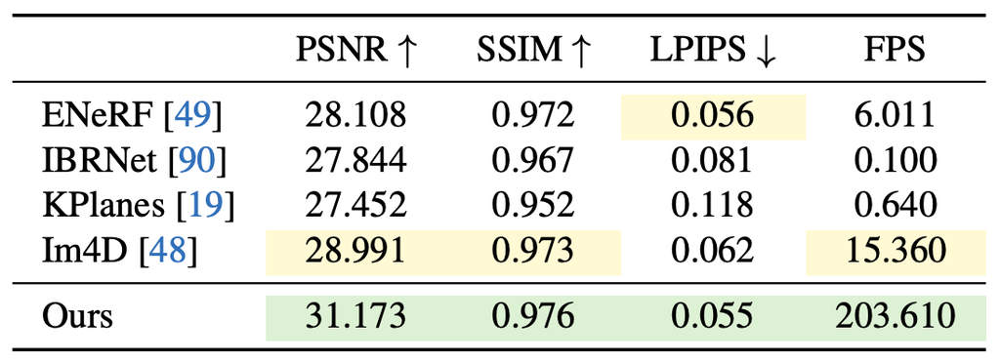
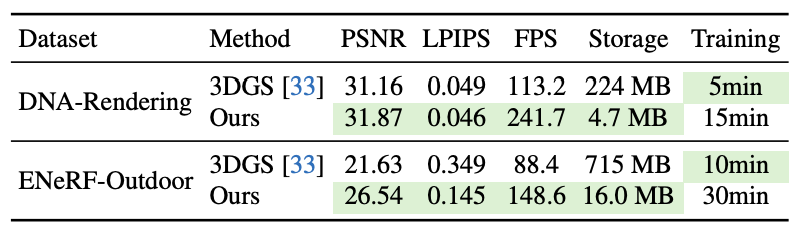

# 图表

## 1. 分工

本文负责 R5 稿件中图表的信息组织、排版和图文接入。科研图件的论证设计、真实数据来源、生成方式与最终视觉检查遵守`指导/能力/科研配图.md`。

一张图或表只承担一个主要判断。读者离开正文仍应理解比较对象、数据、设置、符号和指标。

## 2. 选择图还是表

- 精确数字和多条件查询重要时使用表格
- 趋势、分布、关系、流程或视觉证据重要时使用图
- 同一证据不在图和表中完整重复
- 主结论获得最清楚的位置和视觉层次

## 3. 结果表的信息结构





清楚的结果表通常具备:

- 方法按比较角色合理分组
- 数据集、模型或设置使用分组表头
- 指标在表头标明单位与增减方向
- 数值精度和统计表达一致
- 最佳与次佳结果采用克制且有说明的强调
- 效果与决定公平性的关键成本能够共同读取

## 4. 减少无信息视觉元素

### 移除竖线


使用留白、对齐和分组表头表达列关系。

### 减少横线


横线用于表头、真实分组和表尾, 不为每一行添加边框。

### 突出主要结果


粗体、浅色背景或下划线只强调读者需要完成的核心比较, 并在图注中解释规则。

## 5. TeX 表格骨架

```tex
\begin{table}[t]
    \centering
    \caption{说明实验设置、数据集、指标、统计口径和必要符号。}
    \label{tab:main_result}
    \begin{tabular}{lccc}
        \toprule
        Method & Metric A $\uparrow$ & Metric B $\uparrow$ & Cost $\downarrow$ \\
        \midrule
        Baseline A & -- & -- & -- \\
        Baseline B & -- & -- & -- \\
        \midrule
        Ours & -- & -- & -- \\
        \bottomrule
    \end{tabular}
\end{table}
```

常用包:

```tex
\usepackage{booktabs}
\usepackage{colortbl,xcolor}
```

数值需要按小数点对齐时可使用`siunitx`; 具体包选择服从当前官方模板。

## 6. 图件与图注

图注交付:

1. 图展示什么问题、方法或实验
2. 面板、颜色、线型、误差、箭头和符号怎样阅读
3. 读者应得到什么主要判断
4. 哪项设置或边界影响解释

正文第一次引用图表时先说明为什么此处需要它, 再解释图表怎样改变当前判断。正文不逐项复述面板和数字。

## 7. 最终版面检查

- 标题或图注是否解释数据、设置、指标和符号
- 指标方向、单位、小数位和统计口径是否一致
- 文本列、数字列和分组是否清楚
- 高亮是否只服务核心比较
- 缩放到最终栏宽后字号、图例和误差仍可读
- 灰度和常见色觉条件下仍可区分
- 子图顺序与正文讨论顺序一致
- 图中术语、符号和颜色与全文一致
- 每个定量图表能够追溯到真实数据和生成脚本
- 图表引用、标签和 TeX 编译结果正确

## 8. 参考案例

- [结果表格排版示例](https://x.com/jbhuang0604/status/1626372600824844289)
