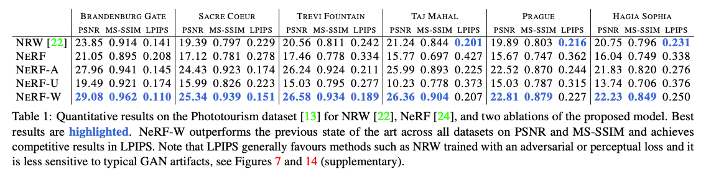
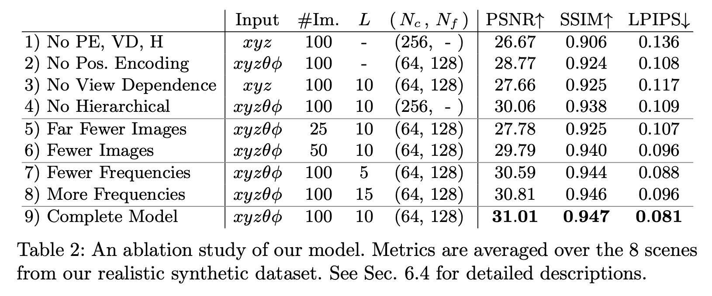
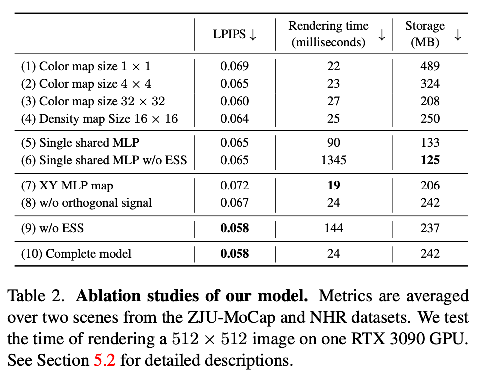

# 实验与结果

## 1. 内容来源

实验部分把 R3 的证明设计和 R4 的正式交付转化为论文论证。方法、基线、协议、数字、成本、失败与主张判定均以真实产物为准。

```text
论文主张 -> 所需证据 -> 实验协议 -> 真实结果 -> 图表 -> 允许写入的结论
```


论文按实际存在的论证关系选择小节:

```tex
\section{Experiments}
% Experimental setup
% Main comparison
% Claim-specific validation
% Ablation studies
% Transfer, efficiency, challenging settings, diagnosis or failures
```

## 2. 实验设置

实验设置提供解释结果所需的信息:

- 任务、数据、划分和评测单位
- 完整方法、方法变体和强基线
- 主要指标及数值方向
- 模型、执行框架、预算和公平比较条件
- 重复次数、聚合、不确定性和失败统计
- 实现细节中会影响结论的设置

共享设置集中说明; 只属于单个实验的条件放在对应小节。正文与附录的分配服从目标场所, 但读者必须能判断比较是否公平。

## 3. 主实验

主实验回答完整方法在主要任务上是否具有总体竞争力。主表或主图同时呈现决定结论的效果和关键资源代价。



已有直接基线时, 统一或精确说明数据划分、信息访问、模型能力、训练条件和预算。没有直接方法时, 使用具有真实理由的适配方法、简单方法、资源匹配对照或替代机制, 并说明它们为什么是有意义的对手。

主实验结果能支持完整系统的总体判断, 不能单独归因到每个组件或证明迁移机制。

## 4. 分点验证

每个核心主张的深化实验先说明要区分的判断, 再报告直接现象。常见关系包括:

| 主张 | 直接证据方向 |
| --- | --- |
| 完整方法总体更好 | 与强基线的公平主实验 |
| 某机制减少目标失败 | 受控条件下的失败类型和中间现象 |
| 两项设计需要共同工作 | 单独启用、联合启用及资源匹配对照 |
| 冻结制品能够迁移 | 明确源条件和目标条件的冻结迁移 |
| 方法更高效 | 同一成本口径下的效果—成本或收敛曲线 |

表中是关系示例, 具体证据由`实验证明.md`确定。

## 5. 消融实验

### 完整方法的核心设计

总表用于展示关键设计及其交互对完整方法的影响。





总表重点回答哪些设计必要、收益如何组合、移除后效果和成本怎样共同变化。

### 模块内部选择

一个机制内部的表示方式、约束、输入质量、超参数或替代设计使用独立小表或曲线。


内部消融用于解释具体设计选择, 不把任意超参数扫描包装为贡献。

## 6. 困难场景、诊断与失败

- 困难场景来自论文真实应用或主张边界
- 案例选择遵守 R3/R4 预定规则并说明代表性
- 定性案例与总体分布或数量统计结合
- 失败结果说明在哪个条件、以什么方式发生及其影响
- 诊断证据解释原因, 不替代总体效果证据

## 7. 写结果段落

一个结果段落通常形成:

```text
研究问题或假设
-> 比较条件和指标
-> 直接观察
-> 对比、不确定性或失败
-> 证据允许的解释
-> 成立边界
```

严格区分:

- **观察**: 真实数值、趋势、分布或失败
- **归因**: 由资源匹配、干预、消融或不变量支持的解释
- **推断**: 仍存在替代解释的合理判断
- **边界**: 当前证据未覆盖或结果失效的条件

正文选择最能改变读者判断的数字, 再解释其意义。完整数字留在图表中, 不逐格复述。

## 8. 图表说明

图表离开正文仍应能够理解, 至少交代:

- 数据集、任务或场景
- 方法和比较条件
- 指标、方向、单位和统计口径
- 缩写、符号、误差和高亮含义
- 主要结论和必要解释边界

详细排版见`指导/写作/章节/图表.md`; 实际图件生成遵守`指导/能力/科研配图.md`。

## 9. 自检

- 主实验是否首先回答完整方法的总体竞争力
- 每项核心认识和设计是否有类型匹配的证据
- 消融是否解释关键组件和交互, 而非机械删模块
- 结果文字是否区分观察、归因和推断
- 摘要、引言、正文、表格和结论中的数字是否一致
- 关键成本是否与效果共同呈现
- 失败与适用边界是否获得与主张强度相称的位置
- 每个结论是否能追溯到 R4 的正式产物

## 10. 参考案例

- [对比实验案例一](https://arxiv.org/pdf/2008.02268.pdf)
- [对比实验案例二](https://arxiv.org/pdf/2003.08934.pdf)
- [消融实验案例一](https://arxiv.org/pdf/2304.06717.pdf)
- [消融实验案例二](https://arxiv.org/pdf/2302.12237.pdf)
