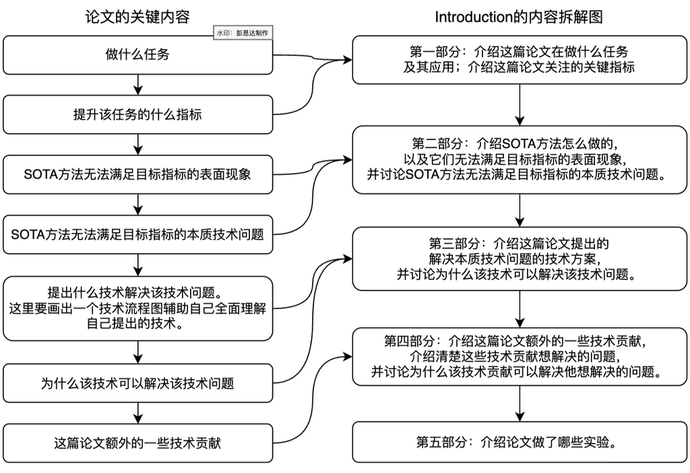

# 引言

## 1. 先倒推再正写

引言先从全文结论倒推:

1. 本文真正解决的技术问题是什么
2. 该问题为什么持续存在, 哪个技术原因最关键
3. 本文的设计怎样直接作用于该原因
4. 这些设计带来什么可检验能力或认识
5. 哪些已有路线必须介绍, 才能公平到达这个问题

倒推关系成立后, 再按读者理解顺序正向写作。图中各项是内容关系, 不是固定段数。



## 2. 总体语义骨架

```tex
\section{Introduction}
% 定位任务、输入输出和真实应用
% 概括已有路线已经解决的部分
% 收窄到目标失败条件、表现和技术原因
% 明确本文解决的精确问题
% 给出核心认识和完整方法
% 解释贡献性设计、运行机制和技术优势
% 概述正式实验支持的主要结果
% 总结实际贡献
```

骨架按论文事实取舍。引言不要求固定段数, 也不要求每篇论文列出贡献项目符号。

## 3. 进入任务的几种方式

### 小众任务先定义输入输出

```text
[Task] aims to recover / reconstruct / estimate [output] from [input].
It supports [representative applications].
```

用一句话定义输入、输出和目标, 再选择真正说明研究价值的应用。

### 熟悉任务直接进入目标场景

```text
[Task] is important for [applications or decisions affected by this work].
```

目标读者已经熟悉任务时, 第一段把篇幅留给当前研究真正需要的场景与矛盾。

### 从一般任务进入特定设置

```text
[General task] supports [applications].
This work focuses on [specific setting], where [input] is used to produce [output].
```

### 第一段直接暴露问题

```text
[Task and relevant application].
Existing methods usually [common mechanism].
They fail under [condition] because [technical reason].
```

当问题能够准确且简洁说明时, 可以尽早出现; 必要背景仍要完整。

## 4. 引出技术问题

目标是解释本文问题为什么必须被解决, 而不是复述领域历史。

### 多代路线逐步收窄

```text
一般困难
-> 传统路线怎样处理及其边界
-> 较新路线修复了什么
-> 较新路线在目标条件下仍留下什么
-> 本文的精确问题
```

每次讨论局限时写清:

- 哪类方法
- 在什么条件下
- 出现什么可观察失败
- 失败的技术原因是什么
- 该原因是文献事实、本文观察还是待验证解释

### 核心认识已有历史先例

当传统路线包含与本文认识相近的思想时, 可以先承认该思想已经解决了什么, 再解释它为什么不能直接满足当前设置。真实先例会使本文的差异更精确, 而不是削弱叙事。

### 新任务缺少直接方法

没有直接既有方法时, 用任务内生的困难组织问题:

```text
Our goal is to [goal].
This problem is challenging because [challenge and reason].
[Additional independent challenge and reason, if needed].
```

困难数量由研究本身决定; 每项困难都应能够映射到后文设计或证据。

## 5. 介绍本文方法

写作前回答:

- 方法解决哪一个技术问题
- 核心认识是什么
- 设计怎样实现该认识
- 相对直接替代方案改变了什么性质
- 哪项结果验证这一变化

### 一项核心贡献和多项优势

```tex
% 提出方法和核心机制
% 指向问题或方法总览图
% 说明核心设计怎样运行
% 说明相对替代方案的优势和证据
```

### 多项相互衔接的贡献

```tex
% 提出统一认识和完整方法
% 贡献一解决什么并产生什么状态
% 该状态还缺少什么
% 贡献二为何是统一认识的必要部分
% 多项设计共同带来的能力和证据
```

后一项设计由真实依赖引出, 不呈现为临时补丁。

### 观察驱动的方法

```tex
% 给出关键观察
% 解释该观察怎样改变问题理解
% 从观察推导具体设计
% 说明技术优势和可验证结果
```

引言必须让读者理解方法本体; 公式、网络参数和复现细节留给方法节。

## 6. 贡献总结

每项贡献包含实际存在的关系:

- 提出了什么认识或设计
- 它解决什么精确问题
- 它带来什么技术优势或新知识
- 哪项证据支持它

贡献总结不拆分普通工程步骤, 也不重复同一贡献的近义表述。

## 7. 自检

- 第一段是否让目标读者知道本文在研究什么
- 背景是否都服务中心矛盾
- 最相近工作是否被准确、公平地呈现
- 每项局限是否包含条件、表现和技术原因
- 方法是否从原因自然推出
- 引言中的方法描述是否具体到能够理解其贡献
- 贡献、方法小节和实验之间是否能建立真实映射
- 实验概述是否只使用正式结果和正确口径
- 读完引言后能否预测后文为什么需要这些方法与实验

## 8. 参考案例

- [任务和应用的引言组织](https://arxiv.org/abs/2212.04965)
- [从一般任务进入特定设置](https://openaccess.thecvf.com/content/CVPR2021/papers/Martin-Brualla_NeRF_in_the_Wild_Neural_Radiance_Fields_for_Unconstrained_Photo_CVPR_2021_paper.pdf)
