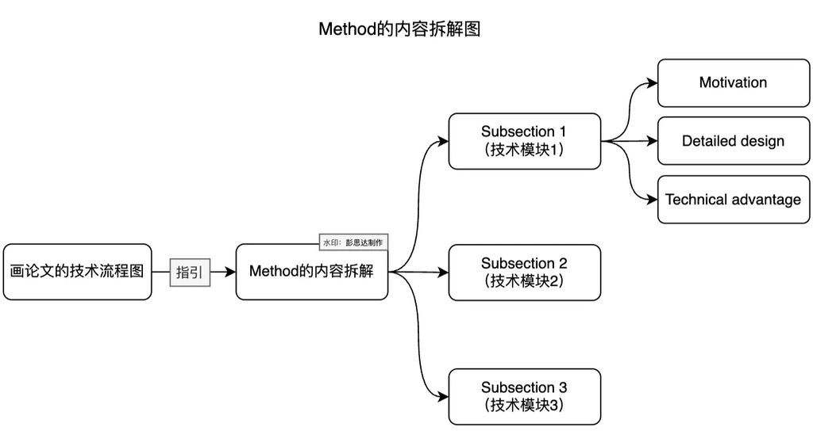

# 方法

## 1. 组织原则

方法部分按读者理解机制所需的依赖顺序组织, 不按代码类、函数、Agent 名称或开发时间组织。写作依据是`叙事定稿.md`中的完整方法与设计关系、R3 固定的方法身份和真实实现。



下面骨架按实际方法增减小节:

```tex
\section{Method}
% Problem setup and overview
% Contribution-bearing mechanism or module 1
% Contribution-bearing mechanism or module 2
% Additional necessary mechanisms
% Implementation details
```

## 2. 问题设置与概览

概览承担:

1. 定义任务、输入、输出和必要符号
2. 用最短文字重述核心认识和完整方法
3. 指向总体方法图并说明主要数据流
4. 说明后续小节怎样依次展开关键设计

```tex
% 输入、输出和问题设置
% 核心认识与完整方法
% 图中的主要状态和数据流
% 后续小节的依赖顺序
```

概览帮助读者建立方法内部结构, 不重复摘要。

## 3. 每个贡献性模块的三项内容


### 模块动机

说明当前状态缺少什么、前一机制为什么不能解决、这一设计承担什么必要责任。

```text
A remaining challenge is [problem].
Previous designs have difficulty under [condition] because [reason].
To address this issue, we introduce [module or mechanism].
```

### 模块设计与运行过程

定义表示、状态或数据结构, 再按真实执行顺序说明输入怎样变为输出, 输出由谁使用。

```text
We represent [object] with [representation].
Given [input], the method [actual ordered operations].
This produces [output], which is used by [downstream operation].
```

写清:

- 输入及其来源
- 中间状态和更新条件
- 输出及其消费者
- 训练、进化与推理阶段的差异
- 与其他模块的依赖
- 失败或退化条件

### 技术优势

与最直接的替代设计比较, 说明机制差异改变了什么可测量性质。

```text
Compared with [alternative], the proposed design [mechanism difference].
This changes [observable property], evaluated by [experiment or metric].
```

技术优势是可以被证据支持或削弱的关系, 不是“更灵活”“更全面”等独立评价。

## 4. 模块小节骨架

```tex
\subsection{Mechanism Name}
% 动机和目标问题
% 输入与核心表示
% 操作或前向步骤
% 状态变化、输出和后续用途
% 相对替代方案的技术优势
% 必要目标、约束或更新规则
```

公式出现前说明它表达什么关系并定义输入与符号; 公式之后解释它在运行过程中的作用。图中名称、正文术语、数学符号和实现配置保持一致。

## 5. 实现细节

实现细节集中保存复现所需、但不承担中心知识增量的内容, 例如:

- 模型、层数、维度和数据结构
- 优化器、学习率、轮次和采样策略
- 归一化、单位、数值稳定性和停止条件
- 推理步骤、模型调用和速度测试条件
- 随机性、硬件与软件环境
- 训练、进化与运行阶段不同的设置

会影响主要结论的设置必须在 R3 共同协议和正文实验设置中显式出现。

## 6. 逐层检查

### 章节

- 小节顺序是否与理解和运行依赖一致
- 每个小节是否承担明确机制责任
- 概览能否让读者预测后续结构

### 段落

- 每段是否围绕动机、设计或优势中的一个主要判断
- 操作顺序是否完整
- 技术优势是否连接到可观察证据

### 句子

- 每个符号首次出现时已经定义
- 每一步都有输入、动作和输出
- 下一句依赖上一句提供的状态或判断
- 同一对象始终使用同一术语

## 7. 自检

- 读者能否根据方法章节还原核心流程
- 每个关键设计是否说明为什么需要、怎样运行和改变什么
- 核心贡献与常规实现是否区分
- 每项优势是否能指向 R3/R4 中的直接证据
- 是否存在图中出现但正文未解释的模块或箭头
- 方法正文是否与正式实验实际运行的方法身份一致
