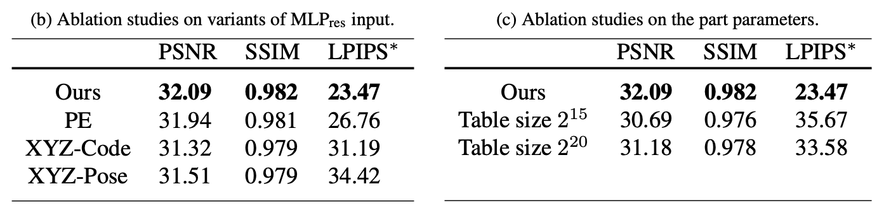

# 实验示例

## 对比实验

### 版本一: 存在基线方法

需要与相关且较新的基线方法比较

### 版本二: 新任务没有直接相关的基线方法

#### 示例一: 构造方法变体


## 消融实验

### 版本一: 核心贡献和重要组件

#### 示例一


#### 示例二


#### 示例三


### 版本二: 单个模块中的设计选择

#### 示例一



## 结果分析

### 版本一: 强结果 -> 关键数值 -> 技术含义 ([DUSt3R](https://openaccess.thecvf.com/content/CVPR2024/html/Wang_DUSt3R_Geometric_3D_Vision_Made_Easy_CVPR_2024_paper.html))

```tex
与当前最佳方法在 Map-free 无地图视觉定位测试集上的比较结果见表 1
总体而言, DUSt3R 优于所有已有方法, 并且在部分指标上具有较大优势; DUSt3R 的中位平移误差低于 1 米, 而其他方法通常介于 1.5 米到 2.5 米之间; 在重投影误差方面, DUSt3R 在 90 像素阈值下的精确率超过 50\%, 曲线下面积接近 70\%, 同样明显优于包括 RoMa [28] 在内的大多数方法, 尽管 RoMa 使用了强大的 DINOv2 预训练 [62]
这些结果表明, DUSt3R 输出的像素对应关系比已有匹配方法更加稳健, 尽管后者专门针对匹配任务进行设计和训练, 而像素对应关系只是本文重建框架产生的多种副产品之一
```

### 版本二: 逐项消融 -> 定量变化 -> 定性现象 -> 技术原因 ([ManhattanSDF](https://openaccess.thecvf.com/content/CVPR2022/html/Guo_Neural_3D_Scene_Reconstruction_With_the_Manhattan-World_Assumption_CVPR_2022_paper.html))

```tex
我们在 ScanNet 上进行消融实验, 以验证各个组件的有效性
实验采用以下 5 种配置: 仅使用图像监督训练网络的原始 VolSDF; 在 VolSDF 上加入第 3.1 节定义的深度监督 $L_d$, 记为 VolSDF-D; 在 VolSDF-D 上加入第 3.2 节定义的法向损失 $L_{\mathrm{geo}}$, 记为 VolSDF-D-G; 在 VolSDF-D 上进一步学习三维语义, 记为 VolSDF-D-S; 学习三维语义并将法向损失替换为第 3.3 节定义的联合优化损失 $L_{\mathrm{joint}}$, 记为本文完整方法
定量结果见表 1, 定性结果见图 4

比较 VolSDF 和 VolSDF-D 可以看到, 由估计的稀疏深度图提供监督后, 精确率提高 0.095, 召回率提高 0.061; 图 4 表明平面区域和非平面区域均有所改善, 但重建结果仍然包含噪声且不完整; 这些结果说明 $L_d$ 能够帮助网络更好地收敛, 但还不足以获得高质量重建结果

随后, 我们研究法向损失对重建性能的影响; 表 1 显示, VolSDF-D-G 的精确率提高 0.031, 但召回率下降 0.020; 图 4 显示, 与 VolSDF-D 相比, VolSDF-D-G 能够重建更加平滑和完整的平面, 但会丢失非平面区域中的部分细节; 这些结果说明 $L_{\mathrm{geo}}$ 能够改善平面区域的重建, 但错误的语义分割可能产生误导, 从而降低非平面区域的性能

为了验证学习语义场的作用, 我们比较 VolSDF-D 和 VolSDF-D-S; 表 1 显示, VolSDF-D-S 的精确率提高 0.047, 召回率提高 0.032; 这些结果表明, 在三维空间中学习语义同样能够辅助重建

为了验证联合优化方式的作用, 我们在表 1 中比较 VolSDF-D-G 和完整方法; 使用 $L_{\mathrm{joint}}$ 替换 $L_{\mathrm{geo}}$ 后, 精确率提高 0.174, 召回率提高 0.151; 图 4 显示, 完整方法在保持平面区域重建质量的同时, 也显著改善了非平面区域的重建结果; 这些结果表明, 完整方法能够获得最为一致的重建结果
```

### 版本三: 结果未达到最佳 -> 原因 -> 实用价值 ([DUSt3R](https://openaccess.thecvf.com/content/CVPR2024/html/Wang_DUSt3R_Geometric_3D_Vision_Made_Easy_CVPR_2024_paper.html))

```tex
本文方法没有达到最佳方法的准确度; 需要指出的是, 这些方法均使用真实相机位姿, 并且在适用时专门使用 DTU 训练集进行训练
此外, 该任务的最佳结果通常依赖具有亚像素精度的三角测量, 因而需要显式相机参数; 相比之下, 本文采用回归方法, 而回归的准确度通常较低
尽管如此, 在完全不知道相机参数的情况下, 本文方法仍然达到 2.7 毫米的平均准确度和 0.8 毫米的完整度, 总体平均距离为 1.7 毫米; 考虑到本文方法即插即用的性质, 我们认为这种精度在实际应用中仍然具有很高的价值
```
