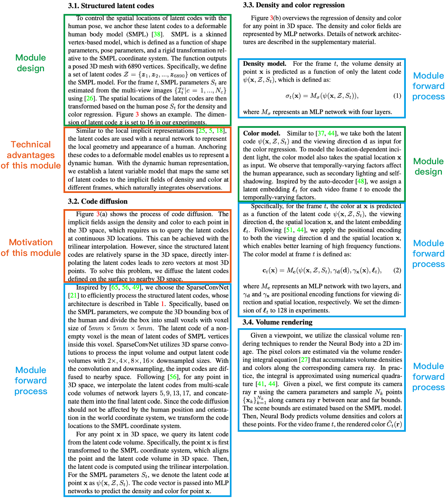

# 方法示例

## 总体结构

```tex
\section{方法}
% 概览
% 第 3.1 节
% 第 3.2 节
% 第 3.3 节
```

## 概览

```tex
% 概览
% 用一到两句话介绍问题设置
%% 例子 1: 给定一段表演者的稀疏多视角视频, 我们的任务是生成该表演者的自由视角视频
%% 例子 2: 给定一张图像, 姿态估计任务需要检测物体, 并估计它们在三维空间中的方向和平移

% 用一到两句话介绍论文的核心贡献
%% 例子 1: 我们以已有静态场景方法 [46] 为基础, 加入时间维度, 并将前向和后向场景流显式建模为稠密三维向量场, 以此估计三维运动
%% 例子 2: 受 [21, 25] 启发, 我们通过变形初始轮廓使其匹配物体边界, 从而完成物体分割
%% 例子 3: 受近期方法 [29, 30, 36] 启发, 我们使用两阶段流程估计物体姿态. 首先使用卷积神经网络检测二维物体关键点, 然后使用 PnP 算法计算六自由度姿态参数. 我们的创新在于一种新的二维物体关键点表示和一种经过修改的姿态估计算法

% 如果论文的技术流程或框架比较新颖, 使用一张图进行介绍
%% 例子: 所提出模型的概览如图 3 所示

% 第 3.1 节描述什么
%% 例子 1: Neural Body 从一组附着在可变形人体模型表面的结构化潜在编码开始, 见第 3.1 节
%% 例子 2: 本节首先介绍如何使用多层感知机映射建模三维场景, 见第 3.1 节

% 第 3.2 节描述什么
%% 例子 1: 表面附近任意位置的潜在编码都可以通过编码扩散过程获得, 见第 3.2 节, 随后由神经网络将其解码为密度值和颜色值, 见第 3.3 节
%% 例子 2: 随后, 第 3.2 节讨论如何使用动态多层感知机映射表示体积视频

% 第 3.3 节描述什么
%% 例子 3: 最后, 我们介绍一些加速渲染过程的策略, 见第 3.3 节
```

## 模块三元素



## 超参数等细节

- 可以写进子模块
- 也可以统一在章节最后写一个 Implementation details 小节
